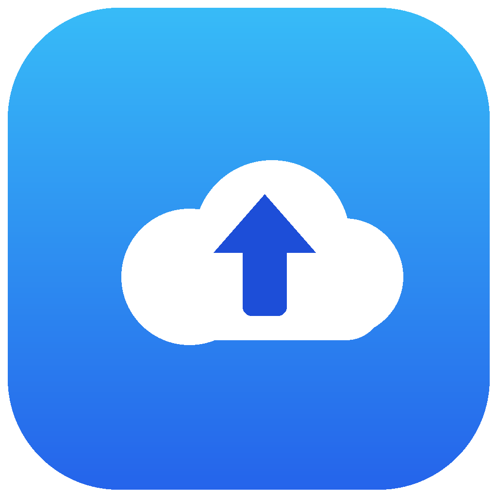

<p align="center">
  
</p>

# iCloudPhoto2Nextcloud

macOS menu-bar agent that syncs your iCloud Photo Library to a [Nextcloud](https://nextcloud.com) server over WebDAV. No Dock icon: the app lives in the menu bar and works in the background.


---

## Features

- **Background sync**: automatic detection of Photo Library changes (PhotoKit) — additions, edits, deletions.
- **Full originals**: original photos, edited renders, Live Photos (HEIC/JPG + MOV pair), RAW/ProRAW, uncompressed videos.
- **Two-phase upload**: indexing/deduplication in a local database (SwiftData), then upload with real progress (`X / Total`).
- **Large files**: above 10 MB, upload is chunked in 5 MB parts (Nextcloud WebDAV Chunked Upload v2).
- **4 concurrent uploads** to speed up libraries with thousands of photos.
- **Mirror mode (optional)**: a photo deleted locally is also deleted on Nextcloud.
- **Deletions detected while offline**: on launch, a full scan finds photos deleted while the app was closed and cleans up the server.
- **Automatic retry**: on failures, rescheduling with backoff (60 s → 120 s → 240 s, 3 cycles max).
- **Pause / resume** at any time, forced full scan on demand.
- **Rich menu**: sync status, statistics, thumbnails of the last 10 synced photos, direct link to Photos settings when permission is missing.
- **Settings & Logs window**: WebDAV connection test, configuration, filterable logs (last 200 entries).
- **Backup verification**: manual or scheduled scan (daily/weekly/monthly) that lists the server content and detects **missing** or **truncated** files (size mismatch). Damaged items are **re-uploaded automatically**.
- **Bilingual French/English**: automatic detection of the system language — French if the system is French, English otherwise.

## Layout on the server

Files are stored in:

```
<target folder>/yyyy/MM/<original filename>
```

Example with the default target folder `Photos/iCloud`:

```
Photos/iCloud/2026/08/IMG_1234.HEIC
Photos/iCloud/2026/08/IMG_1234.MOV   (Live Photo video)
```

## Requirements

- **macOS 14.0** or later.
- An accessible **Nextcloud** server (including self-hosted over HTTP — a warning then shows in the settings).
- A Nextcloud **app password**, not your main password: *Settings → Security → App passwords* in your instance.
- To build: **Xcode 26+** (the project uses `objectVersion = 77` and `SWIFT_DEFAULT_ACTOR_ISOLATION = MainActor`).

## Installation

Every build on `main` publishes a new [GitHub Release](https://github.com/nitatemic/iCloudPhoto2Nextcloud/releases/latest) with the three binaries (**unsigned**):

| Architecture | Download |
|---|---|
| Intel + Apple Silicon (recommended) | [iCloudPhoto2Nextcloud-Universal.zip](https://github.com/nitatemic/iCloudPhoto2Nextcloud/releases/latest/download/iCloudPhoto2Nextcloud-Universal.zip) |
| Apple Silicon only | [iCloudPhoto2Nextcloud-macOS-AppleSilicon-arm64.zip](https://github.com/nitatemic/iCloudPhoto2Nextcloud/releases/latest/download/iCloudPhoto2Nextcloud-macOS-AppleSilicon-arm64.zip) |
| Intel only | [iCloudPhoto2Nextcloud-macOS-Intel-x86_64.zip](https://github.com/nitatemic/iCloudPhoto2Nextcloud/releases/latest/download/iCloudPhoto2Nextcloud-macOS-Intel-x86_64.zip) |

The builds are **unsigned**: on first launch, right-click the app → *Open*, or run `xattr -dr com.apple.quarantine "iCloudPhoto2Nextcloud.app"`.

## Configuration

1. Open the menu bar menu → **Settings & Logs…**.
2. Fill in the **server URL** (e.g. `https://cloud.example.dev` — the `https://` scheme is added automatically if missing), the **username** and the **app password**.
3. Click **Test connection** to validate WebDAV access.
4. Adjust the **remote folder** (default `Photos/iCloud`) and the **mirror** option (remote deletion when a photo is deleted locally).
5. **Save the settings**: a full scan starts immediately.

On first launch, macOS asks for Photo Library access. If denied, the menu offers a direct shortcut to *System Settings → Privacy & Security → Photos*.

## Building from source

```bash
# Build
xcodebuild -scheme iCloudPhoto2Nextcloud -destination 'platform=macOS' build

# Unit tests only (fast, no UI)
xcodebuild test -scheme iCloudPhoto2Nextcloud -destination 'platform=macOS' \
  -only-testing:iCloudPhoto2NextcloudTests

# Single test
xcodebuild test -scheme iCloudPhoto2Nextcloud -destination 'platform=macOS' \
  -only-testing:iCloudPhoto2NextcloudTests/NextcloudConfigTests/testUsernameEncoding
```

Integration tests against a **real Nextcloud server** (silently skipped without these variables):

```bash
TEST_NEXTCLOUD_URL=https://cloud.example.dev \
TEST_NEXTCLOUD_USER=user \
TEST_NEXTCLOUD_PASS=xxxx-xxxx-xxxx \
xcodebuild test -scheme iCloudPhoto2Nextcloud -destination 'platform=macOS' \
  -only-testing:iCloudPhoto2NextcloudTests
```

## Architecture

| Component | Role |
|---|---|
| `SyncEngine` | Orchestrator (`@MainActor @Observable`, singleton). Two-phase cycle, pause, statistics, deferred deletions, automatic retries. |
| `PhotoObserver` | PhotoKit wrapper: change observation (`PHPhotoLibraryChangeObserver`), extraction of originals (Live Photos, RAW, videos) via `PHAssetResourceManager`. |
| `NextcloudWebDAVService` | Actor: MKCOL/PUT/DELETE, chunked upload above 10 MB, cache of created folders, retry on 409 conflict. |
| `SyncedAsset` / `SyncedResource` | SwiftData models persisted to disk (local tracking, deduplication, `pending/syncing/synced/failed` statuses). |
| `NextcloudConfig` | Configuration: password in the **Keychain**, everything else in `UserDefaults` (`nc_*` keys). |
| Views | `StatusMenuView` (menu), `ConfigurationWindow` (Settings + Logs), `PhotoThumbnailView` (thumbnails). |

### Concurrency

- `SyncEngine` lives on the MainActor; network uploads are **asynchronous and parallel** (4 at a time, `TaskGroup`).
- Only one sync cycle at a time: PhotoKit events received during a cycle trigger a **follow-up scan** at the end of the cycle.
- Local deletions detected during a cycle are **deferred** to avoid deleting models still referenced by the upload loop.

## Security & privacy

- **macOS sandbox** enabled: outbound network + photo library only.
- The **app password is stored in the Keychain** (never in iCloud, never in the logs); configuration stays local.
- `NSAllowsArbitraryLoads` is enabled to support self-hosted HTTP instances: an explicit warning shows in the settings when the URL starts with `http://`.
- Photos' **internal adjustment data** (edits, proprietary Apple format) is **not** sent: only usable files (original + edited render) go to the server.

## Known limitations

- With **limited Photo Library access** («Selected Photos» mode), the deletion scan is disabled (it would be misleading on a subset of assets).
- **HEIC previews in the Nextcloud web interface** depend on the server configuration (imagick/ffmpeg, `preview:generate` task).
- **Launch at login** (optional): the agent starts automatically at session login (SMAppService), toggled in the settings.
- The menu thumbnails cover the last 10 **synced** photos (not the whole library).

## Development

- **Commit conventions**: [Conventional Commits](https://www.conventionalcommits.org) (`feat:`, `fix:`, `ci:`, `docs:`, `chore:`…).
- **Localization**: French is the source language (`Localizable.xcstrings`, French keys + `en` translations); every new string must be added in French with its English translation in the catalog.
- `AGENTS.md` contains the verified commands and project pitfalls for AI agents.
- **CI**: `.github/workflows/build-macos.yml` builds three unsigned zips (universal, x86_64, arm64) on `macos-26` with Xcode 26 on every push to `main`, and publishes them as a new GitHub Release (tag `ci-<sha>`, marked Latest).

---

« iCloudPhoto2Nextcloud » — your iCloud photos, backed up wherever you want.
